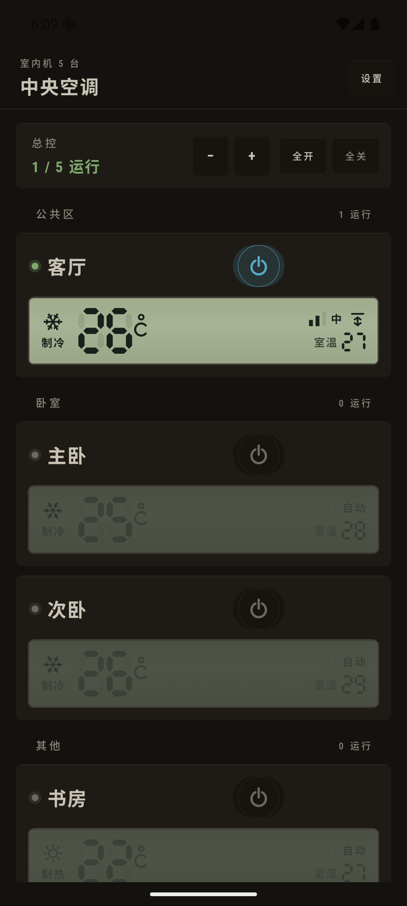
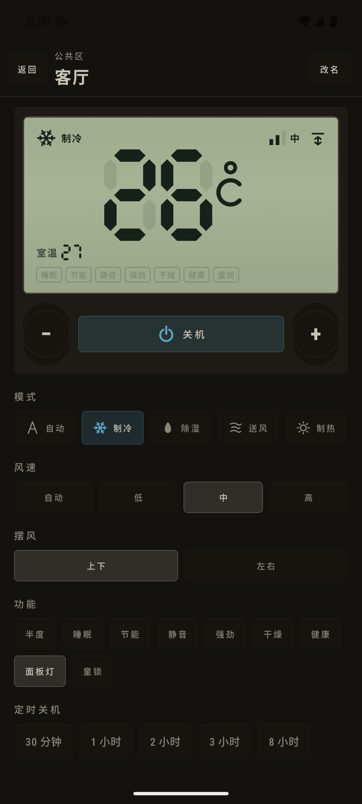
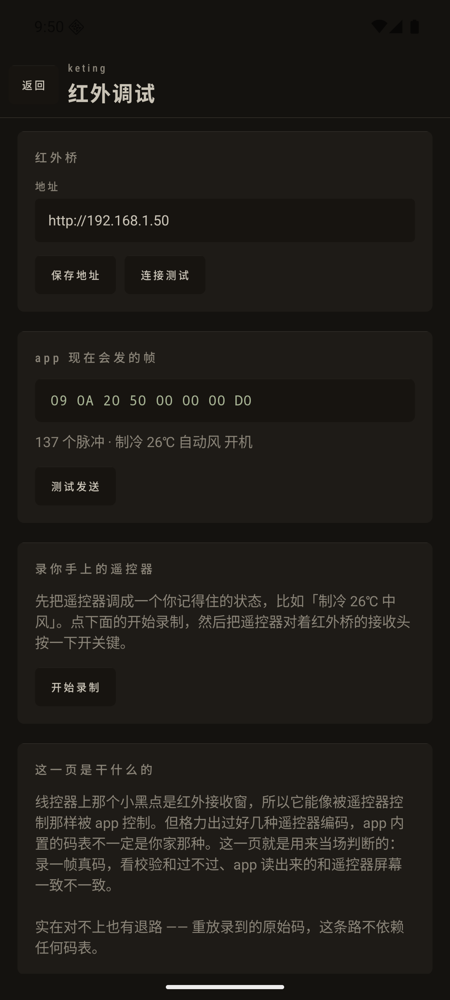

# 中央空调

一个安卓 app，用来控制家里的多台中央空调室内机：开关、模式、温度、风速、摆风、
睡眠/节能等功能、定时关机，以及一键全开全关和按分区分组。

界面照着墙上那块格力 XK27 线控器做的——灰绿段码液晶、圆形按键、丝印标签，
未点亮的液晶段也照样画出来。用过墙上那块板子的人不用学。

| 机柜 | 单机控制 |
|---|---|
|  |  |

（[红外调试](screenshots/05-红外调试.png) · [添加室内机](screenshots/03-添加室内机.png) · [设置](screenshots/04-设置.png)）

---

## 手机怎么才能控到空调

XK27 是**有线**线控器，它自己不联网，所以手机不可能直接对它下命令。中间必须有一条
真实链路。app 把这件事做成了可插拔的 `Transport`：

| 链路 | 走什么 | 双向? | 说明 |
|---|---|---|---|
| **红外**（主用） | app 算 38 kHz 波形，ESP8266/ESP32 小板发射 | 否 | 对着线控器上那个小黑点（红外接收窗）发码 |
| **演示** | 什么都不发，本机模拟 | 是 | 先把界面、命名、分区安排好 |
| **局域网** | UDP 7000 + AES，格力自家局域网协议 | 是 | 只有室内机侧装了格力 Wi-Fi 模块才可用 |

装上先是 5 台演示机，不接任何硬件就能把整个 app 走一遍。

---

## 红外：做一个桥，然后当场验证

**手机有没有红外发射口不影响这条路。** app 只算波形，通过 Wi-Fi 把它交给一台
**红外桥**，由桥上的红外灯对着那个小黑点发射。app 里「手机没有红外口」那句话只是说
手机不能自己当发射器——填了桥地址就跟它无关了。（少数还带红外口的手机可以把地址
留空，直接用手机发。）

### 要买的东西

| 件 | 大概价格 | 说明 |
|---|---|---|
| ESP8266 NodeMCU 板（或 ESP32） | ¥15–25 | 固件 `docs/ir-bridge.ino` 两种都能编 |
| 940nm 红外发射管 | ¥0.2 | 买一版，烧了随手换 |
| 220Ω 电阻 | ¥0.1 | 串在发射管上 |
| **VS1838B 红外接收头** | ¥0.5 | **别省这个** —— 「红外调试」页录遥控器真码全靠它，也是码表对不上时唯一的退路 |
| 杜邦线 / 面包板、USB 电源 | ¥10 | 手机充电头就能供电 |

接线（ESP8266 / NodeMCU，引脚号在固件开头，ESP32 改一下就行）：

```
红外发射管 长脚 → 220Ω → D2 (GPIO4)      短脚 → GND
红外接收头 OUT  → D5 (GPIO14)   VCC → 3V3   GND → GND
```

固件里改两行 Wi-Fi 名字和密码，刷进去，串口会打印它的 IP。把这个 IP 填进 app 的
「红外桥地址」。

摆位：红外灯要能直视线控器上那个小黑点，一两米内、别有遮挡。发不动先怀疑没对准，
其次才怀疑码表。

### 码表这件事必须说清楚

波形时序用的是格力那套成熟参数（9000/4500 引导，620 位标记，1600/540 一零间隔，
35 位 + `010` 分隔 + 32 位），**这部分可靠**。

但 8 个字节里每一位放什么，是按格力手持遥控器（YAC 那一族）的格式写的。格力出过
好几种手柄，你家线控器不一定认这套。**所以 app 里有一页专门用来当场判断**：
打开某台红外室内机 → 底部「红外调试」。



那一页能做四件事：

1. **连接测试** —— 红外桥在不在、信号多少、发过多少帧。
2. **看 app 现在会发的帧** —— 8 个字节的十六进制、脉冲数、以及这帧按 app 的理解
   是什么设置。可以直接「测试发送」，看线控器有没有反应。
3. **录你手上的遥控器** —— 把遥控器调成一个你记得住的状态（比如「制冷 26℃ 中风」），
   对着红外桥的接收头按一下。app 会给出三个判断：
   - 脉冲数对不对得上格力格式（137 个）
   - **校验和过不过** —— 过了说明位序和校验规则都对
   - **app 把这帧读成了什么** —— 拿这个和遥控器屏幕上显示的对比，哪一项不一样，
     就说明哪个字段的位置写错了
4. **重放录到的帧** —— 原样发回去。这条路不依赖任何码表，只要线控器认它自己的
   遥控器，就一定认这个。

真对不上的话，把那一页截图发出来，改 `GreeIrEncoder.Frame` 里对应的位就行——
每个字段都单独命名、单独一行，改一个位就是改一行。

红外是单向的，所以 app 显示的是**最后发出去的设置**，不是室内机回报的状态。控制页
底部会明确说这一点，读不到的功能（室温、半度、节能、静音、童锁）直接不显示，
而不是给一个按下去会弹回来的开关。

---

## 编译和安装

需要 JDK 17+（本机用 21）和 Android SDK（compileSdk 37）。

```bash
echo "sdk.dir=$HOME/Library/Android/sdk" > local.properties   # 没有的话
./gradlew assembleDebug
adb install -r app/build/outputs/apk/debug/app-debug.apk
```

最低支持 Android 7.0（minSdk 24）。用 Android Studio 直接打开根目录也可以。

---

## 应用内自动更新

设置页顶上有「版本」一栏：当前版本、更新源、检查更新、每天自动查。

流程是：app 查 GitHub Releases 里最新的 tag，比版本号，有新的就显示版本号和更新说明，
点「下载并安装」下载 APK，最后一步交给系统的安装界面——**不会自己装**。
安卓 8 以上第一次会让你去开「允许安装未知应用」，那一页有直达按钮。

「每天自动查」开着的话，每天最多查一次，只有真有新版本才会在底部提示一句；
查失败不打扰。版本号只往前走，把旧 commit 重新打 tag 也不会把手机降级回去。

更新源在 `app/build.gradle.kts` 的 `UPDATE_REPO` 里。

### 签名：别踩这个坑

**只有签名相同的 APK 才能覆盖安装。** 所以要分发的包必须用同一个 keystore 签，
不能用 debug key（每台机器的 debug key 都不一样，CI 上更是每次都不同）。

工程里已经配好了：

- 本地：`keystore.properties` + `keystore/release.jks`，两个都在 `.gitignore` 里。
  有它们 `./gradlew assembleRelease` 就出签名包。
- CI：同样四个值从环境变量读（`KEYSTORE_FILE` / `KEYSTORE_PASSWORD` /
  `KEY_ALIAS` / `KEY_PASSWORD`）。
- **没有 keystore 时 release 包是未签名的，不会偷偷退回 debug key** ——
  签名缺失一眼能看出来，比装不上却不知道为什么好。

keystore 和它的密码**丢了就再也没法更新已装的 app**，只能卸载重装。备份好。

> 换签名要卸载一次：如果手机上装的是早期的 debug 包，签名和 release 包不一样，
> 装不上去。先卸载再装 v1.0.0 或更新的 release 包，之后应用内更新就一路顺了。

### 发一个版本

```bash
# 1. 改版本号
#    app/build.gradle.kts: versionCode = 2, versionName = "1.1.0"
# 2. 打 tag 推上去
git tag v1.1.0 && git push origin v1.1.0
```

`.github/workflows/release.yml` 会编签名 APK 并挂到这个 release 上，app 就能看到。
不想用 CI 的话，本地 `./gradlew assembleRelease`，把
`app/build/outputs/apk/release/app-release.apk` 手动传到 release 里，效果一样。

CI 需要四个 secret：

```bash
base64 -i keystore/release.jks | tr -d '\n' | gh secret set KEYSTORE_BASE64
gh secret set KEYSTORE_PASSWORD   # keystore.properties 里的 storePassword
gh secret set KEY_ALIAS           # hvacpanel
gh secret set KEY_PASSWORD        # 同 storePassword
```

---

## 局域网（格力协议）

`transport/GreeLanTransport.kt`。所有报文都是 UDP 7000 上的 JSON，`pack` 字段是
AES 加密后的 JSON：

```
scan    广播 {"t":"scan"}      → 每台室内机回自己的 name / mac
bind    通用密钥换设备密钥      → 每台只做一次，密钥存在本机
status  报列名，收对应的值      → Pow / Mod / SetTem / WdSpd / TemSen …
cmd     发 opt/p 键值对        → 室内机回它接受了什么
```

* 通用密钥 `a3K8Bx%2r8Y7#xDh` 是所有格力 Wi-Fi 模块出厂都一样的，公开信息。
  绑定后每台机器有自己的密钥，存在 `files/units.json`。
* 实现的是 **V1（AES-ECB）**。新固件还有 GCM 变体——能搜到但绑定失败大概就是这个原因。
* 室温 `TemSen` 有的固件报原始值、有的报 +40 偏移，两种都处理了。
* 童锁不在这套协议里，所以局域网室内机不显示童锁开关（见 `Caps`）。

---

## 代码结构

```
model/          AcState（一台机器在做什么）、AcUnit、Mode、FanSpeed
transport/      Transport 接口 + 三个实现 + 格力加密 / 红外编解码
control/        AcController（唯一和 transport 说话的地方）、定时关机
update/         查 GitHub Releases、下载、交给系统安装
data/           units.json 读写、几个偏好设置
ui/theme/       配色、字体
ui/lcd/         段码液晶：数字、图标、液晶面材质
ui/components/  面板、按键、丝印标签、输入框
ui/screens/     机柜（首页）、单机控制、红外调试、添加、设置
```

### 几个关键决定

**先改本地，再发出去。** 按下去界面同帧就变，命令等 340 ms 才发——按住 ⊕ 从 26 走到
22 只发一条命令，不是四条。

**已经在路上的命令绝不取消。** UDP 报文和红外帧发出去就收不回来了，所以在飞的写
不打断；期间又改了的话，标记为「还得再发一次」，等这条落地再发下一条。

**红外帧连发两遍。** 单向链路上丢一帧就是「线控器没反应」，多发一遍很便宜。

**轮询不会盖掉还没发出去的改动**，而且退到后台就停（不在后台耗电）。

**能力按链路区分。** 读不回状态的链路就不显示那些开关，而不是给一个按下去会弹回来
的按钮（见 `transport/Caps`）。

**定时存的是时刻，不是时长。** 所以「还剩 12 分钟」是真的在倒数，重启 app 也还在。
用的是非精确闹钟——卧室的机器 23:04 停还是 23:00 停没人在意，为这个去要精确闹钟
权限不值得。

**液晶的鬼影段是签名，但小尺寸必须关掉。** 室温那个小读数和启动图标都不画鬼影，
不然会糊成一团；段码字母在 40dp 以下也不可读，℃ 和 AUTO 改用描边画。

---

## 已知的边界

* **红外码表未经你家硬件验证** —— 见上面「红外」那节，有当场验证的办法和退路。
* **手机重启后待执行的定时关机会丢**（没写开机广播接收器）。app 重开时会清掉已经
  过期的定时，不会显示假的倒计时。
* 局域网只实现了 V1 加密，GCM 固件绑定会失败。
* 场景（回家/离家/夜间）没做，目前只有总控全开/全关和按分区看。
* 没有小组件、没有语音、没有远程——只在同一个局域网内可用。

## 隐私

室内机列表、绑定密钥、偏好设置都在手机本地（`files/units.json` 和 SharedPreferences）。
没有账号。除了查更新会访问 GitHub，其余只跟你家局域网里的设备说话。
